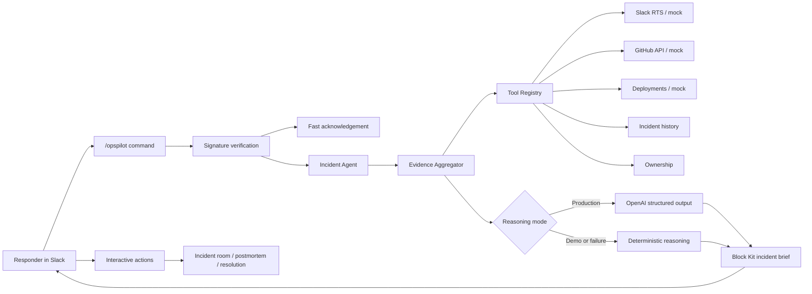

# OpsPilot

> **AI incident command, where the response already happens.**

OpsPilot is a Slack-first AI Incident Commander built for the **Slack Agent Builder Challenge**. It turns an operational report into an evidence-backed incident brief, recommended response plan, incident room, postmortem draft, and resolution update without moving responders out of Slack.

The web application is a submission and architecture surface. **Slack is the primary product interface.**

## Demo command

```text
/opspilot investigate checkout API returning 500 errors after latest deploy
```

For judging, set `DEMO_MODE=true`. The checkout scenario then uses deterministic Slack history, commits, deployments, ownership, prior incidents, and reasoning while still receiving real signed Slack commands and button actions.

## Demo flow

1. A responder runs `/opspilot investigate ...` in Slack.
2. OpsPilot immediately acknowledges the report.
3. Independent tools collect Slack, GitHub, deployment, incident-history, and ownership evidence.
4. OpsPilot posts a concise incident brief with severity, impact, confidence, likely causes, actions, owners, and next-update time.
5. Responders can **Open Incident Room**, **Draft Postmortem**, or **Resolve Incident**.

See the complete [three-minute demo script](docs/demo-script.md).

## Features

- Signed Slack slash-command and interactivity endpoints
- Fast acknowledgement with deferred investigation delivery
- Typed, concurrent evidence-tool architecture with partial-failure tolerance
- Structured OpenAI reasoning with independent validation and deterministic fallback
- Real GitHub commit retrieval, detail enrichment, relevance ranking, and mock fallback
- Slack Real-Time Search-ready adapter with defensive response mapping and mock fallback
- Polished Block Kit incident briefs and actionable incident-workflow buttons
- Incident channel creation, response checklist, postmortem draft, and resolution update
- Demo mode that makes the primary checkout outage path fully deterministic
- Vercel-compatible Next.js App Router deployment and `/api/health` endpoint

## Architecture



The agent receives only normalized `InvestigationEvidence`; it does not depend on provider response shapes. Replacing a mock provider changes a tool or service adapter, not the incident reasoning or Slack UI. See [docs/architecture.md](docs/architecture.md) for the full flow.

## Project structure

```text
app/
  api/health/             Runtime health endpoint
  api/slack/commands/     Slash-command endpoint
  api/slack/actions/      Interactivity endpoint
  page.tsx                Submission landing page
docs/                     Architecture, Devpost copy, and demo script
src/
  agents/                 Evidence aggregation and incident reasoning
  data/                   Deterministic incident and deployment fixtures
  lib/                    Constants, logging, validation, and utilities
  services/               OpenAI, GitHub, and Slack RTS adapters
  slack/                  Blocks, handlers, client, commands, and verification
  tools/                  Independent evidence tools and registry
  types/                  Domain and integration contracts
```

## Technologies used

- Slack Platform: slash commands, Block Kit, Web API, interactivity, signing verification
- Next.js 16 App Router and React 19
- Strict TypeScript
- Tailwind CSS 4
- OpenAI Responses API with JSON Schema output
- GitHub REST API
- Vercel Functions

## Local development

Prerequisites: Node.js 20.9+ and npm 10+.

```bash
npm install
cp .env.example .env.local
npm run dev
```

Open `http://localhost:3000`. Check runtime mode at `http://localhost:3000/api/health`.

Quality commands:

```bash
npm run typecheck
npm run lint
npm run build
```

## Environment variables

| Variable | Required | Purpose |
| --- | --- | --- |
| `SLACK_BOT_TOKEN` | Slack flow | Posts messages and manages incident channels |
| `SLACK_SIGNING_SECRET` | Slack flow | Verifies command and interaction signatures |
| `SLACK_APP_TOKEN` | No | Reserved for Slack Socket Mode |
| `SLACK_RTS_ENABLED` | No | Enables configured Slack search when exactly `true` |
| `SLACK_RTS_API_URL` | RTS only | Slack RTS or approved proxy endpoint |
| `SLACK_RTS_TOKEN` | RTS only | Server-side bearer token for the RTS endpoint |
| `OPENAI_API_KEY` | AI only | Enables structured AI reasoning outside demo mode |
| `OPENAI_MODEL` | No | Model override; defaults to `gpt-4o-mini` |
| `DEMO_MODE` | Recommended | `true` forces deterministic evidence and reasoning |
| `GITHUB_TOKEN` | GitHub only | Token with repository Contents read access |
| `GITHUB_OWNER` | GitHub only | Repository account or organization |
| `GITHUB_REPO` | GitHub only | Repository name without `.git` |
| `NEXT_PUBLIC_APP_URL` | Deployment | Public application URL |

Never expose server tokens through `NEXT_PUBLIC_*` variables.

## Slack setup

1. Create a Slack app and install it to the demo workspace.
2. Add bot scopes:
   - `commands`
   - `chat:write`
   - `channels:manage`
   - `channels:read`
   - `chat:write.public` when posting to public channels the app has not joined
3. Reinstall the app after changing scopes.
4. Create `/opspilot` under **Slash Commands** with:

   ```text
   https://<your-domain>/api/slack/commands
   ```

5. Enable **Interactivity & Shortcuts** with:

   ```text
   https://<your-domain>/api/slack/actions
   ```

6. Configure `SLACK_SIGNING_SECRET` and `SLACK_BOT_TOKEN`.
7. For local Slack testing, expose `npm run dev` through an HTTPS tunnel and use that public URL.

## Demo mode and production fallbacks

When `DEMO_MODE=true`:

- Slack RTS is never called; mock Slack history is used.
- GitHub is never called; mock commits are used.
- Mock deployment signals are used.
- OpenAI is never called; deterministic reasoning is used.
- Real Slack commands, messages, channel creation, and button actions still run.

Outside demo mode, missing configuration, timeouts, rate limits, malformed responses, empty RTS results, invalid AI output, and individual tool failures degrade safely to mock or deterministic results. Tool execution and selected fallback paths are logged without secrets.

## External integrations

### GitHub

Set `DEMO_MODE=false`, `GITHUB_TOKEN`, `GITHUB_OWNER`, and `GITHUB_REPO`. Fine-grained tokens need **Contents: read** for the selected repository. OpsPilot retrieves ten commits and enriches the newest three with changed files when available.

### Slack Real-Time Search-ready adapter

Set `DEMO_MODE=false`, `SLACK_RTS_ENABLED=true`, `SLACK_RTS_API_URL`, and `SLACK_RTS_TOKEN`. The adapter accepts Slack's `results.messages` response and conservative proxy variants. Slack bot-token calls to `assistant.search.context` require an action token, so a production installation may use an approved proxy or appropriate user-token flow.

### OpenAI

Set `DEMO_MODE=false` and `OPENAI_API_KEY`. OpsPilot requests JSON Schema-constrained output, validates the complete investigation independently, and falls back deterministically on any failure.

## Vercel deployment

1. Import the repository into Vercel.
2. Keep the default Next.js build command: `npm run build`.
3. Add the required environment variables for Preview and Production.
4. Deploy and verify `https://<your-domain>/api/health`.
5. Configure the deployed Slack command and interactivity URLs.
6. Reinstall the Slack app after any scope changes and run the demo command.

All external clients are initialized at request time, so missing build-time secrets do not break static generation.

## Known limitations

- Slash-command payloads do not include a message timestamp for the acknowledgement, so the final result is posted to the originating channel rather than a guaranteed thread. Threading would require changing delivery to first create a Web API message and retain its `ts`.
- Deployment evidence is currently deterministic mock data; no deployment-provider API is connected.
- RTS credentials and action-token exchange depend on the production Slack installation model.
- Incident state is not persisted; action handlers reconstruct deterministic incident context.
- Buttons do not yet disable after use, so repeated actions are possible.
- MCP is intentionally not implemented in this stage.

## Future roadmap

- Persist incident state, action idempotency keys, and audit events
- Add durable background execution and retry handling
- Integrate a production deployment provider
- Add workspace-specific RTS authorization and citation controls
- Add evaluation suites for AI/deterministic parity and Block Kit snapshots
- Add MCP adapters behind the existing tool registry
- Add observability, access controls, and incident analytics

## Hackathon submission notes

OpsPilot is designed around three judging outcomes:

- **Useful Slack experience:** the complete response loop happens in Slack.
- **Technical quality:** signed requests, typed tools, validated AI output, provider isolation, and graceful fallback.
- **Demonstrable impact:** responders move from an ambiguous outage report to a coordinated plan in one command.

Submission assets:

- [Devpost copy](docs/devpost.md)
- [Three-minute demo script](docs/demo-script.md)
- [Architecture source](docs/architecture.md)

## License

[MIT](LICENSE)
