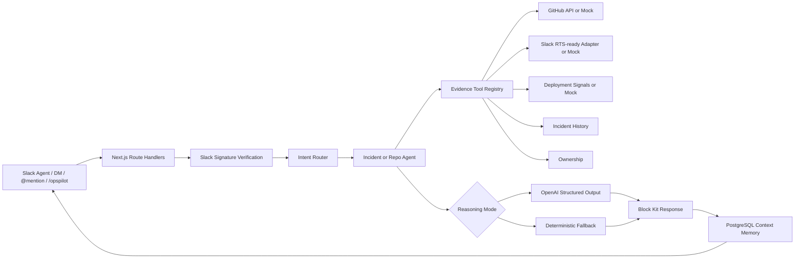

# OpsPilot


**Slack-native AI engineering operations agent for incident response and repository intelligence.**

OpsPilot installs into Slack, connects to a workspace GitHub repository, investigates incidents, audits recent code changes, answers follow-up questions, opens incident channels, drafts postmortems, and preserves operational context with PostgreSQL.

Built for the **Slack Agent Builder Challenge**.

## Links

- Live app: [https://opspilot-puce.vercel.app](https://opspilot-puce.vercel.app)
- Command guide: [`/commands`](https://opspilot-puce.vercel.app/commands)
- Demo video: add hosted YouTube, Loom, or Devpost link here
- Devpost: add Devpost submission link here

The full local demo video is intentionally not committed because it is approximately 265 MB. See [public/demo/README.md](public/demo/README.md) for media placement guidance.

## Why this project matters

OpsPilot demonstrates production-oriented engineering across product design, distributed integrations, AI fallback strategy, OAuth, Slack platform workflows, serverless architecture, persistence, and testing. For recruiters, it shows the ability to take an ambiguous AI-agent idea and ship a credible multi-tenant product experience with clear operational constraints.

## Product flow

```text
Add to Slack
-> authorize workspace
-> connect GitHub
-> choose repository
-> finish setup
-> open Slack
-> use OpsPilot from the agent surface, DM, @mention, or /opspilot
```

Slack remains the primary interface. The website is a companion for install, setup, docs, and portfolio presentation.

## Demo media and screenshots

Recommended portfolio assets:

- Homepage screenshot: `public/screenshots/homepage.png`
- Slack Agent screenshot: `public/screenshots/slack-agent.png`
- Incident investigation screenshot: `public/screenshots/incident-investigation.png`
- Repository audit screenshot: `public/screenshots/repository-audit.png`
- Incident room screenshot: `public/screenshots/incident-room.png`
- Generated postmortem screenshot: `public/screenshots/postmortem.png`
- Demo thumbnail: `public/demo/opspilot-demo-thumbnail.png`

Do not commit large videos. Host the final demo video externally and link it from this README.

## Core capabilities

- Slack OAuth installation and workspace-specific bot-token storage
- Slack Agent Experience support with suggested prompts, assistant status updates, and contextual thread titles
- Direct agent conversations through `message.im`
- App mentions and `/opspilot` slash commands
- Interactive Block Kit incident actions
- GitHub OAuth and repository picker
- Workspace-specific project configuration
- Incident investigation with evidence, severity, impact, owners, next steps, and postmortem draft
- Repository audit for recent commits, risky paths, config/security concerns, and test planning
- Context-aware follow-up questions
- PostgreSQL incident memory with in-memory fallback
- OpenAI structured reasoning with deterministic fallback
- Demo mode for reliable judging and walkthroughs

## Supported Slack commands and questions

Recommended: open OpsPilot from Slack's agent surface. The same engine also supports DMs, mentions, and slash commands.

Incident response:

```text
@OpsPilot investigate checkout failures
@OpsPilot show evidence
@OpsPilot show timeline
@OpsPilot explain the leading hypothesis
@OpsPilot who owns checkout-api?
@OpsPilot generate postmortem
@OpsPilot mark resolved
/opspilot investigate checkout API is failing
```

Repository intelligence:

```text
@OpsPilot check my repo for issues
@OpsPilot summarize this repo
@OpsPilot explain the highest risk change
@OpsPilot what should I test?
@OpsPilot write release notes
@OpsPilot create a rollback runbook
@OpsPilot who should review this?
/opspilot audit repo
```

Help:

```text
@OpsPilot help
@OpsPilot what can you do?
/opspilot help
```

## Incident response workflow

1. User reports an issue in Slack.
2. OpsPilot acknowledges quickly.
3. Evidence tools collect Slack history, GitHub commits, deployment signals, prior incidents, and ownership data.
4. The incident agent produces a concise Block Kit brief.
5. Responders can create an incident room, generate a postmortem draft, or mark the incident resolved.
6. Follow-up questions reuse the active workspace/channel/thread context.

In demo mode, the checkout API outage scenario is deterministic and uses mock evidence. In production mode, GitHub evidence can come from the workspace-selected repository.

## Repository audit workflow

1. User asks OpsPilot to audit the connected repository.
2. OpsPilot loads workspace GitHub configuration.
3. It reviews recent commits and changed-file metadata.
4. Risk is grouped into security, operational, configuration, database migration, documentation-only, and unknown-risk categories.
5. Follow-up questions can request test plans, release notes, rollback runbooks, ownership suggestions, or risk explanations.

Repository audit mode does not use SEV/customer-impact/postmortem language unless the user starts an incident investigation.

## Architecture overview



See [docs/architecture.md](docs/architecture.md) and [docs/adr](docs/adr) for details.

## System design decisions

- Slack-first interface instead of dashboard-first workflow
- Tool-based agent architecture with provider isolation
- Deterministic fallback for demo reliability and provider failures
- Workspace-specific OAuth tokens before environment fallback
- PostgreSQL for durable incident memory in serverless environments
- Separate incident and repository workflows to avoid misleading outputs
- Request-time client initialization so missing build-time secrets do not break static generation

## Technology stack

- Next.js App Router
- React
- TypeScript
- Tailwind CSS
- Slack Platform, Block Kit, Web API, Agents & AI Apps
- GitHub OAuth and REST API
- OpenAI structured reasoning
- PostgreSQL via `pg`
- Vercel
- Node.js built-in test runner

## Database schema and migrations

Migrations live in [db/migrations](db/migrations):

1. `001_create_incidents.sql` - persistent incident memory
2. `002_create_slack_installations.sql` - Slack workspace installs
3. `003_create_project_configs.sql` - workspace repository/project config
4. `004_create_github_installations.sql` - per-workspace GitHub OAuth tokens

Apply migrations in order:

```bash
psql "$DATABASE_URL" -f db/migrations/001_create_incidents.sql
psql "$DATABASE_URL" -f db/migrations/002_create_slack_installations.sql
psql "$DATABASE_URL" -f db/migrations/003_create_project_configs.sql
psql "$DATABASE_URL" -f db/migrations/004_create_github_installations.sql
```

If `DATABASE_URL` is missing, OpsPilot falls back to bounded in-memory incident context.

## Local setup

Prerequisites:

- Node.js 20.9+
- npm 10+
- Optional PostgreSQL database

Install:

```bash
npm install
cp .env.example .env.local
npm run dev
```

Open:

```text
http://localhost:3000
```

Health:

```text
GET /api/health
```

## Environment variables

| Variable | Purpose |
| --- | --- |
| `SLACK_BOT_TOKEN` | Developer/manual bot-token fallback |
| `SLACK_SIGNING_SECRET` | Slack request verification |
| `SLACK_APP_TOKEN` | Reserved for Socket Mode |
| `SLACK_CLIENT_ID` | Slack OAuth client ID |
| `SLACK_CLIENT_SECRET` | Slack OAuth client secret |
| `SLACK_REDIRECT_URI` | Slack OAuth callback URL |
| `SLACK_RTS_ENABLED` | Enables RTS-ready adapter when `true` |
| `SLACK_RTS_API_URL` | Optional RTS/proxy endpoint |
| `SLACK_RTS_TOKEN` | Optional RTS/proxy token |
| `OPENAI_API_KEY` | Optional AI reasoning |
| `OPENAI_MODEL` | Optional model override |
| `DEMO_MODE` | Forces deterministic evidence/reasoning when `true` |
| `DATABASE_URL` | PostgreSQL connection string |
| `GITHUB_TOKEN` | Developer/global GitHub fallback |
| `GITHUB_OWNER` | Environment fallback owner |
| `GITHUB_REPO` | Environment fallback repository |
| `GITHUB_CLIENT_ID` | GitHub OAuth client ID |
| `GITHUB_CLIENT_SECRET` | GitHub OAuth client secret |
| `GITHUB_REDIRECT_URI` | GitHub OAuth callback URL |
| `NEXT_PUBLIC_APP_URL` | Public app URL |
| `NEXT_PUBLIC_SLACK_INSTALL_URL` | Optional public Slack install URL |

Never expose server tokens through `NEXT_PUBLIC_*`.

## Slack developer configuration

Required bot scopes:

- `commands`
- `app_mentions:read`
- `chat:write`
- `channels:manage`
- `channels:read`
- `groups:read`
- `im:history`
- `im:read`
- `im:write`
- `users:read`
- `chat:write.public` if posting to public channels before the app joins

Required URLs:

- Slash command: `/api/slack/commands`
- Interactivity: `/api/slack/actions`
- Events API: `/api/slack/events`
- OAuth callback: `/api/slack/oauth/callback`

Required bot events:

- `app_mention`
- `message.im`
- `assistant_thread_started`
- `assistant_thread_context_changed`

Enable Agents & AI Apps in the Slack developer dashboard.

## GitHub OAuth configuration

Create a GitHub OAuth app with:

- Homepage URL: your deployed OpsPilot URL
- Callback URL: `/api/github/oauth/callback`

OpsPilot stores GitHub access tokens server-side per Slack workspace. Runtime priority:

1. Workspace GitHub OAuth token and selected repository
2. Environment `GITHUB_TOKEN` plus `GITHUB_OWNER` / `GITHUB_REPO`
3. Deterministic mock data

## Production deployment

1. Deploy the Next.js app to Vercel.
2. Configure environment variables.
3. Provision PostgreSQL and run migrations.
4. Configure Slack OAuth, Events API, slash command, and interactivity URLs.
5. Configure GitHub OAuth.
6. Install OpsPilot through Add to Slack.
7. Complete setup and choose a repository.
8. Verify `/api/health`.

## Testing

```bash
npm run typecheck
npm run lint
npm run build
npm test
git diff --check
```

Current automated tests cover:

- Slack signature verification
- Intent routing
- Repository audit phrase matching
- Slack direct-message filtering
- Bot/subtype message filtering
- Repository risk classification
- Documentation-only change handling
- Duplicate concern removal

## Security considerations

See [docs/security.md](docs/security.md).

Summary:

- Slack requests are HMAC-verified and timestamp-limited.
- OAuth tokens are stored server-side and never returned to frontend responses.
- Workspace data is scoped by Slack `team_id`.
- GitHub access prefers workspace tokens over global fallbacks.
- SQL uses parameterized queries.
- Demo mode avoids external AI/GitHub/RTS calls.

Known hardening items: application-level token encryption, authenticated setup sessions, durable event deduplication, and action idempotency.

## Known limitations

- Setup pages are lightweight and do not yet include first-party user authentication.
- Slack event deduplication is process-local.
- Button actions are not fully idempotent.
- Deployment provider evidence is mocked.
- Repository audit is not a full static-analysis scanner.
- Slack Real-Time Search is adapter-ready, not claimed as live unless configured.
- MCP is intentionally not implemented.
- Full demo video should be hosted externally rather than committed.

## Roadmap

- Durable action idempotency and audit logs
- Application-level token encryption
- Authenticated setup sessions
- Shared event deduplication store
- Deployment provider integration
- Richer repository analysis and CI correlation
- Evaluation snapshots for Slack Block Kit output
- MCP adapters behind the existing tool registry

## Additional documentation

- [Architecture](docs/architecture.md)
- [Security](docs/security.md)
- [Demo review](docs/demo-review.md)
- [Resume positioning](docs/resume.md)
- [Final QA checklist](docs/final-qa-checklist.md)
- [Architecture decision records](docs/adr)

## License

[MIT](LICENSE)
