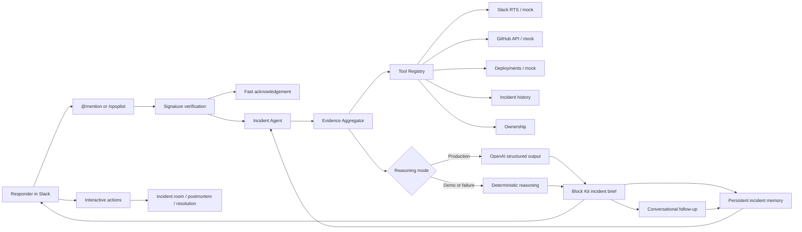

# OpsPilot

> **AI incident command, where the response already happens.**

OpsPilot is a conversational, Slack-first AI Incident Commander built for the **Slack Agent Builder Challenge**. Mention it naturally or use the slash command to turn an operational report into an evidence-backed incident brief, recommended response plan, incident room, postmortem draft, and resolution update without moving responders out of Slack.

The web application is a submission and architecture surface. **Slack is the primary product interface.**

## Demo command

```text
/opspilot investigate checkout API returning 500 errors after latest deploy
@OpsPilot investigate checkout failures
/opspilot audit repo
@OpsPilot check my repo for issues
```

Then continue naturally: `@OpsPilot explain why you think the database is responsible` or `@OpsPilot generate an executive summary`.

Recommended conversational path: open OpsPilot from Slack's Agents & AI Apps surface. Mentions and slash commands remain fully supported.

For judging, set `DEMO_MODE=true`. The checkout scenario then uses deterministic Slack history, commits, deployments, ownership, prior incidents, and reasoning while still receiving real signed Slack commands and button actions.

## Workflows

OpsPilot now supports two Slack-native workflows:

1. **Incident investigation** — use `/opspilot investigate <issue>` or `@OpsPilot investigate checkout failures` when responders are actively debugging an outage or degraded service.
2. **Repository audit / recent-change review** — use `/opspilot audit repo` or `@OpsPilot check my repo for issues` to review recent commits, changed files, risky paths, config/security concerns, and recommended validation steps without starting an incident workflow.

## Demo flow

1. A responder mentions `@OpsPilot` naturally or runs `/opspilot investigate ...` in Slack.
2. OpsPilot immediately acknowledges the report.
3. Independent tools collect Slack, GitHub, deployment, incident-history, and ownership evidence.
4. OpsPilot posts a concise incident brief with severity, impact, confidence, likely causes, actions, owners, and next-update time.
5. Responders can **Open Incident Room**, **Draft Postmortem**, or **Resolve Incident**.
6. Follow-up mentions reuse the active incident for summaries, explanations, status, timelines, owners, deployments, evidence, and postmortems.

See the complete [three-minute demo script](docs/demo-script.md).

## SaaS onboarding flow

OpsPilot has a single product onboarding path:

```text
Add to Slack
→ Slack OAuth
→ Project setup
→ Connect GitHub and choose a repository
→ Use OpsPilot in Slack
```

After installation, users are redirected to `/setup?team_id=...` to connect workspace project context. The primary path connects GitHub through OAuth, opens `/setup/github?team_id=...`, lets the workspace choose an accessible repository, and saves the selected owner/repo into `project_configs`. Manual owner/repo entry remains available as an advanced fallback.

Slack OAuth, per-workspace GitHub OAuth, repository picking, and project configuration are implemented. Runtime GitHub evidence uses a workspace GitHub token when available, then falls back to the deployment-wide `GITHUB_TOKEN`, then deterministic mock commits.

### Conversational intents

| Intent | Example |
| --- | --- |
| `investigate` | `@OpsPilot investigate checkout failures` |
| `summarize` | `@OpsPilot generate an executive summary` |
| `explain` | `@OpsPilot why do you think the database is responsible?` |
| `status` | `@OpsPilot what is the current status?` |
| `timeline` | `@OpsPilot show the incident timeline` |
| `owner` | `@OpsPilot who owns checkout-api?` |
| `deployments` | `@OpsPilot show recent deployments` |
| `evidence` | `@OpsPilot what evidence supports this conclusion?` |
| `postmortem` | `@OpsPilot draft the postmortem` |
| `resolve` | `@OpsPilot mark the incident resolved` |
| `repo_audit` | `@OpsPilot review recent changes` |
| `repo_summary` | `@OpsPilot summarize this repo` |
| `risk_explain` | `@OpsPilot explain the highest risk change` |
| `test_plan` | `@OpsPilot what should I test?` |
| `release_notes` | `@OpsPilot write release notes` |
| `next_steps` | `@OpsPilot what should we do next?` |
| `runbook` | `@OpsPilot create a rollback runbook` |
| `owners` | `@OpsPilot who should review this?` |
| `help` | `@OpsPilot help` |

## Features

- Signed Slack Events API, slash-command, and interactivity endpoints
- Slack Agents & AI Apps assistant threads with suggested prompts, live status updates, and contextual thread titles
- Natural-language intent routing across incident and repository-audit intents
- Threaded `@OpsPilot` conversations with active incident context
- Fast acknowledgement with deferred investigation delivery
- Typed, concurrent evidence-tool architecture with partial-failure tolerance
- Structured OpenAI reasoning with independent validation and deterministic fallback
- Real GitHub commit retrieval, detail enrichment, relevance ranking, and mock fallback
- Repository health audit mode for recent-change, risky-path, config, and security review
- Slack Real-Time Search-ready adapter with defensive response mapping and mock fallback
- Polished Block Kit incident briefs and actionable incident-workflow buttons
- Incident channel creation, response checklist, postmortem draft, and resolution update
- Demo mode that makes the primary checkout outage path fully deterministic
- Durable incident memory with PostgreSQL and in-memory fallback
- Vercel-compatible Next.js App Router deployment and `/api/health` endpoint

## Architecture



The agent receives only normalized `InvestigationEvidence`; it does not depend on provider response shapes. Replacing a mock provider changes a tool or service adapter, not the incident reasoning or Slack UI. See [docs/architecture.md](docs/architecture.md) for the full flow.

## Project structure

```text
app/
  api/health/             Runtime health endpoint
  api/incidents/          Recent incident memory endpoint
  api/setup/project/      Project configuration endpoint
  api/slack/commands/     Slash-command endpoint
  api/slack/events/       App-mention Events API endpoint
  api/slack/actions/      Interactivity endpoint
  api/slack/install/      Slack OAuth install redirect
  api/slack/oauth/        Slack OAuth callback
  api/github/install/     GitHub OAuth install redirect
  api/github/oauth/       GitHub OAuth callback
  api/github/repos/       Safe repository picker data
  setup/                  Post-install project setup page
  setup/github/           Per-workspace repository picker
  setup/success/          Onboarding completion page
  page.tsx                Submission landing page
db/
  migrations/             PostgreSQL schema migrations
docs/                     Architecture, Devpost copy, and demo script
src/
  agents/                 Context, intent routing, aggregation, and reasoning
  data/                   Deterministic incident and deployment fixtures
  lib/                    Constants, logging, validation, and utilities
  services/               OpenAI, GitHub, and Slack RTS adapters
  slack/                  Blocks, handlers, client, commands, and verification
  tools/                  Independent evidence tools and registry
  tools/repoAuditTool.ts  Repository audit workflow tool
  types/                  Domain and integration contracts
```

## Technologies used

- Slack Platform: Events API, app mentions, slash commands, Block Kit, Web API, interactivity, signing verification
- Next.js 16 App Router and React 19
- Strict TypeScript
- Tailwind CSS 4
- OpenAI Responses API with JSON Schema output
- GitHub REST API
- PostgreSQL via `pg`
- Vercel Functions

## Local development

Prerequisites: Node.js 20.9+ and npm 10+.

```bash
npm install
cp .env.example .env.local
npm run dev
```

Open `http://localhost:3000`. Check runtime mode at `http://localhost:3000/api/health`.

Quality commands:

```bash
npm run typecheck
npm run lint
npm run build
```

## Environment variables

| Variable | Required | Purpose |
| --- | --- | --- |
| `SLACK_BOT_TOKEN` | Slack flow | Posts messages and manages incident channels |
| `SLACK_SIGNING_SECRET` | Slack flow | Verifies command and interaction signatures |
| `SLACK_APP_TOKEN` | No | Reserved for Slack Socket Mode |
| `SLACK_CLIENT_ID` | OAuth install | Slack OAuth client ID for Add to Slack |
| `SLACK_CLIENT_SECRET` | OAuth install | Slack OAuth client secret for token exchange |
| `SLACK_REDIRECT_URI` | OAuth install | OAuth callback URL, usually `/api/slack/oauth/callback` |
| `SLACK_RTS_ENABLED` | No | Enables configured Slack search when exactly `true` |
| `SLACK_RTS_API_URL` | RTS only | Slack RTS or approved proxy endpoint |
| `SLACK_RTS_TOKEN` | RTS only | Server-side bearer token for the RTS endpoint |
| `OPENAI_API_KEY` | AI only | Enables structured AI reasoning outside demo mode |
| `OPENAI_MODEL` | No | Model override; defaults to `gpt-4o-mini` |
| `DEMO_MODE` | Recommended | `true` forces deterministic evidence and reasoning |
| `DATABASE_URL` | No | PostgreSQL connection string for persistent incident memory |
| `GITHUB_TOKEN` | GitHub fallback | Deployment-wide token with repository Contents read access |
| `GITHUB_OWNER` | GitHub fallback | Repository account or organization when no workspace config exists |
| `GITHUB_REPO` | GitHub fallback | Repository name without `.git` when no workspace config exists |
| `GITHUB_CLIENT_ID` | GitHub OAuth | GitHub OAuth app client ID for per-workspace repository access |
| `GITHUB_CLIENT_SECRET` | GitHub OAuth | GitHub OAuth app client secret used server-side for token exchange and signed state |
| `GITHUB_REDIRECT_URI` | GitHub OAuth | OAuth callback URL, usually `/api/github/oauth/callback` |
| `NEXT_PUBLIC_APP_URL` | Deployment | Public application URL |
| `NEXT_PUBLIC_SLACK_INSTALL_URL` | No | Public Slack OAuth install URL; shows Developer Preview when unset |

Never expose server tokens through `NEXT_PUBLIC_*` variables.

## Persistent incident memory

OpsPilot stores the active incident context for follow-up mentions, Slack button actions, recent incident visibility, and serverless continuity.

When `DATABASE_URL` is configured, OpsPilot uses PostgreSQL. When `DATABASE_URL` is missing or a database operation fails, OpsPilot logs a concise warning and falls back to the existing 12-hour in-memory store. Demo mode does not require a database.

### Local PostgreSQL setup

1. Create a local PostgreSQL database.
2. Set `DATABASE_URL` in `.env.local`.
3. Run migrations in order:

   ```bash
   psql "$DATABASE_URL" -f db/migrations/001_create_incidents.sql
   psql "$DATABASE_URL" -f db/migrations/002_create_slack_installations.sql
   psql "$DATABASE_URL" -f db/migrations/003_create_project_configs.sql
   psql "$DATABASE_URL" -f db/migrations/004_create_github_installations.sql
   ```

4. Start the app:

   ```bash
   npm run dev
   ```

5. Verify memory health:

   ```text
   http://localhost:3000/api/health
   ```

The health response includes:

```json
{
  "memory": "persistent",
  "database": "connected"
}
```

Recent incidents are available at:

```text
GET /api/incidents
```

The endpoint returns only safe summary fields: incident ID, title, service, severity, status, created time, and updated time. It does not expose full investigation JSON.

## Slack setup

1. Create a Slack app.
2. Enable **Agents & AI Apps** in the Slack developer dashboard for the app.
3. Add bot scopes:
   - `commands`
   - `app_mentions:read`
   - `chat:write`
   - `channels:manage`
   - `channels:read`
   - `groups:read`
   - `im:history`
   - `im:read`
   - `im:write`
   - `users:read`
   - `chat:write.public` when posting to public channels the app has not joined
4. Under **OAuth & Permissions**, set the redirect URL:

   ```text
   https://<your-domain>/api/slack/oauth/callback
   ```

5. Configure environment variables:
   - `SLACK_CLIENT_ID`
   - `SLACK_CLIENT_SECRET`
   - `SLACK_REDIRECT_URI=https://<your-domain>/api/slack/oauth/callback`
   - `SLACK_SIGNING_SECRET`

6. The homepage **Add to Slack** button uses `NEXT_PUBLIC_SLACK_INSTALL_URL` when provided. Otherwise it links to:

   ```text
   https://<your-domain>/api/slack/install
   ```

7. Create `/opspilot` under **Slash Commands** with:

   ```text
   https://<your-domain>/api/slack/commands
   ```

8. Enable **Interactivity & Shortcuts** with:

   ```text
   https://<your-domain>/api/slack/actions
   ```

9. Under **Event Subscriptions**, enable events and set the request URL to:

   ```text
   https://<your-domain>/api/slack/events
   ```

10. Subscribe to these bot events:
   - `app_mention`
   - `message.im`
   - `assistant_thread_started`
   - `assistant_thread_context_changed`
11. Install through Add to Slack. OpsPilot stores the workspace bot token in `slack_installations`.
12. For manual/demo installs, `SLACK_BOT_TOKEN` remains supported as a global fallback.
13. For local Slack testing, expose `npm run dev` through an HTTPS tunnel and use that public URL.

### Slack Agents & AI Apps behavior

When a user opens OpsPilot from Slack's official agent surface, OpsPilot handles assistant-thread events through the same signed Events API route used for mentions. It sets concise suggested prompts, displays `assistant.threads.setStatus` updates while work is running, and sets contextual assistant thread titles such as "Checkout incident investigation", "OpsPilot repository audit", "Release test plan", and "Incident postmortem".

User messages typed in the agent direct-message conversation are delivered by Slack as the `message.im` bot event. OpsPilot routes those direct messages through the same conversational handler as assistant and mention requests, ignores bot/subtype events, and uses the message `ts` as the conversation thread identifier when Slack does not include `thread_ts`.

Assistant status and title calls are best-effort. If Slack rejects or does not support a helper call in a workspace, OpsPilot logs a concise warning and still completes the response through the normal Slack message path.

## GitHub OAuth setup

Create a GitHub OAuth app for OpsPilot:

1. In GitHub, create an OAuth app.
2. Set the homepage URL to your deployed app URL.
3. Set the authorization callback URL:

   ```text
   https://<your-domain>/api/github/oauth/callback
   ```

4. Configure environment variables:
   - `GITHUB_CLIENT_ID`
   - `GITHUB_CLIENT_SECRET`
   - `GITHUB_REDIRECT_URI=https://<your-domain>/api/github/oauth/callback`

OpsPilot requests `repo read:user` so private repository metadata and commit history can be read for repositories the installer can access. Tokens are stored server-side in `github_installations`, associated with the Slack `team_id`, and are never returned to the browser or Slack.

## Project setup flow

After Slack OAuth succeeds, OpsPilot redirects to:

```text
/setup?team_id=<slack-team-id>
```

The setup page is a guided onboarding step. It stores workspace project context:

- GitHub OAuth connection status
- Selected GitHub owner/repo from the repository picker
- Default service name
- Service path mapping JSON
- Deployment provider: Mock, Vercel, Render, or GitHub Actions

Primary setup path:

```text
/setup?team_id=...
-> /api/github/install?team_id=...
-> GitHub OAuth
-> /setup/github?team_id=...
-> repository picker
-> /setup/success?team_id=...
```

Project setup posts to:

```text
POST /api/setup/project
```

The repository picker reads safe repository metadata from:

```text
GET /api/github/repos?team_id=<slack-team-id>
```

The API loads the workspace GitHub token from `github_installations`, fetches repositories from GitHub, and returns only safe metadata such as ID, name, owner, visibility, default branch, and URL.

Manual owner/repo entry remains available under **Advanced/manual setup**. It is useful for demo environments or deployments that intentionally use the server-side `GITHUB_TOKEN` fallback.

After a successful save, the browser redirects to:

```text
/setup/success?team_id=<slack-team-id>
```

The success page confirms the workspace, connected repository, default service, GitHub OAuth status, and example Slack commands.

## Demo mode and production fallbacks

When `DEMO_MODE=true`:

- Slack RTS is never called; mock Slack history is used.
- GitHub is never called; mock commits are used.
- Mock deployment signals are used.
- OpenAI is never called; deterministic reasoning is used.
- Real Slack commands, messages, channel creation, and button actions still run.
- Conversational intent routing and context reuse remain deterministic.

Outside demo mode, missing configuration, timeouts, rate limits, malformed responses, empty RTS results, invalid AI output, and individual tool failures degrade safely to mock or deterministic results. Tool execution and selected fallback paths are logged without secrets.

## External integrations

### GitHub

Set `DEMO_MODE=false` and connect GitHub during setup. The GitHub tool resolves credentials in this order:

1. Workspace GitHub OAuth token from `github_installations`
2. Deployment-wide `GITHUB_TOKEN`
3. Deterministic mock commits

The repository is resolved in this order:

1. Workspace project config from `project_configs`
2. `GITHUB_OWNER` / `GITHUB_REPO`
3. Deterministic mock commits

OpsPilot retrieves ten commits and enriches the newest three with changed files when available. If GitHub is unavailable, rate-limited, misconfigured, or missing permissions, the investigation safely falls back to mock commit signals.

### Slack Real-Time Search-ready adapter

Set `DEMO_MODE=false`, `SLACK_RTS_ENABLED=true`, `SLACK_RTS_API_URL`, and `SLACK_RTS_TOKEN`. The adapter accepts Slack's `results.messages` response and conservative proxy variants. Slack bot-token calls to `assistant.search.context` require an action token, so a production installation may use an approved proxy or appropriate user-token flow.

### OpenAI

Set `DEMO_MODE=false` and `OPENAI_API_KEY`. OpsPilot requests JSON Schema-constrained output, validates the complete investigation independently, and falls back deterministically on any failure.

## Vercel deployment

1. Import the repository into Vercel.
2. Keep the default Next.js build command: `npm run build`.
3. Provision a PostgreSQL database, or leave `DATABASE_URL` unset for demo/in-memory mode.
4. If using PostgreSQL, run migrations in order:
   - `001_create_incidents.sql`
   - `002_create_slack_installations.sql`
   - `003_create_project_configs.sql`
   - `004_create_github_installations.sql`
5. Add required environment variables for Preview and Production, including `DATABASE_URL`, Slack OAuth credentials, GitHub OAuth credentials, and optionally `GITHUB_TOKEN` as a fallback.
6. Deploy and verify `https://<your-domain>/api/health`.
7. Configure the deployed Slack command, Events API, OAuth redirect, and interactivity URLs.
8. Install through Add to Slack, complete `/setup`, and run the demo command.

All external clients are initialized at request time, so missing build-time secrets do not break static generation.

## Known limitations

- App-mention responses and their button results are threaded. Slash-command payloads do not include an acknowledgement message timestamp, so slash-command results remain channel-level.
- Persistent incident memory, OAuth installation storage, and project setup require running all SQL migrations. Without `DATABASE_URL`, OpsPilot intentionally falls back to bounded 12-hour in-memory context and manual `SLACK_BOT_TOKEN` usage.
- The setup page is intentionally lightweight and does not yet implement user authentication beyond possession of a Slack `team_id` link.
- Deployment evidence is currently deterministic mock data; no deployment-provider API is connected.
- RTS credentials and action-token exchange depend on the production Slack installation model.
- Buttons do not yet disable after use, so repeated actions are possible.
- MCP is intentionally not implemented in this stage.

## Future roadmap

- Add action idempotency keys and durable audit events
- Add durable background execution and retry handling
- Integrate a production deployment provider
- Add workspace-specific RTS authorization and citation controls
- Add evaluation suites for AI/deterministic parity and Block Kit snapshots
- Add MCP adapters behind the existing tool registry
- Add observability, access controls, and incident analytics

## Hackathon submission notes

OpsPilot is designed around three judging outcomes:

- **Useful Slack experience:** the complete response loop happens in Slack.
- **Technical quality:** signed requests, typed tools, validated AI output, provider isolation, and graceful fallback.
- **Demonstrable impact:** responders move from an ambiguous outage report to a coordinated plan in one command.

Submission assets:

- [Devpost copy](docs/devpost.md)
- [Three-minute demo script](docs/demo-script.md)
- [Architecture source](docs/architecture.md)
- [Final QA checklist](docs/final-qa-checklist.md)

## License

[MIT](LICENSE)
