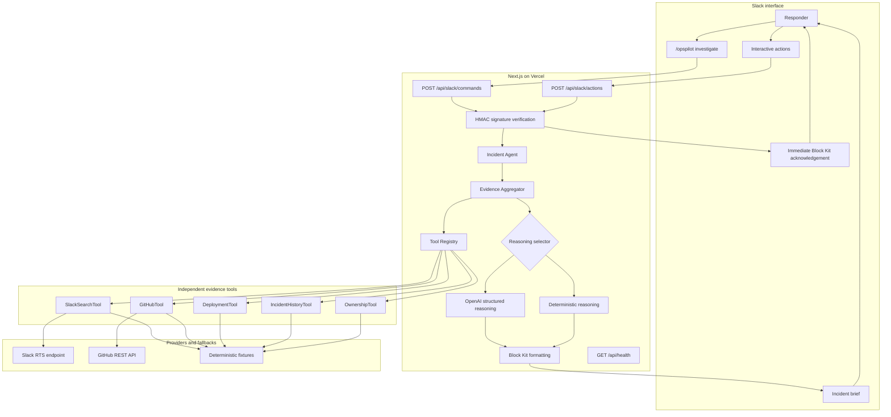
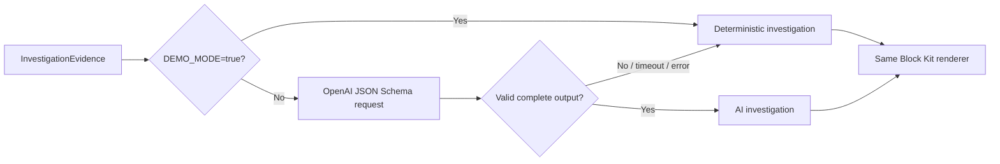

# OpsPilot Architecture

OpsPilot separates Slack transport, evidence collection, reasoning, and presentation so each layer can evolve without changing the user-facing workflow.

## System diagram

## Slack command flow

1. Slack sends a form-encoded command to `POST /api/slack/commands`.
2. Middleware validates `x-slack-signature`, rejects stale timestamps, and compares the HMAC signature safely.
3. The route parses `investigate <issue>` and returns an immediate in-channel acknowledgement.
4. Next.js `after()` continues the investigation after the HTTP response.
5. The final Block Kit brief is posted through `chat.postMessage`.

Slash-command payloads do not provide the acknowledgement message timestamp. Because a reliable `thread_ts` is unavailable, the final result is posted to the originating channel. Threading would require changing the delivery model to create and retain the initial Web API message timestamp.

## Tool orchestration flow

`EvidenceAggregator` asks the registry for every `IncidentTool` and executes them concurrently. Every tool receives the same `InvestigationQuery` and returns one strongly typed result. Tools do not call each other, know about Block Kit, or perform incident reasoning.

Each execution records duration and success or failure. A failed tool becomes a `ToolExecutionFailure`; successful results are still assembled into `InvestigationEvidence`. This lets reasoning continue with partial evidence.

## AI fallback flow

The model is instructed to use only supplied evidence. Its response must match the complete `IncidentInvestigation` schema and then pass independent runtime validation. AI failure never reaches the Slack route as an exception.

## GitHub and Slack RTS-ready integrations

`GitHubTool` uses live GitHub data only when demo mode is off and all repository credentials exist. It retrieves ten recent commits, enriches the newest three with changed files, calculates issue/service relevance, and falls back to mock signals on any failure.

`SlackSearchTool` uses live search only when demo mode is off, RTS is explicitly enabled, and endpoint credentials exist. `slackRealTimeSearch.ts` maps Slack's official `results.messages` response and conservative proxy variants from `unknown` using type guards. Empty, malformed, failed, or timed-out requests fall back to mock history.

The agent and aggregator see the same evidence contracts regardless of source.

## Demo mode behavior

With `DEMO_MODE=true`:

| Layer | Behavior |
| --- | --- |
| Slack commands and actions | Real, signed Slack traffic remains enabled |
| Slack search evidence | Deterministic mock history |
| GitHub evidence | Deterministic mock commits |
| Deployment evidence | Deterministic mock deployments |
| Incident history and ownership | Deterministic fixtures |
| Reasoning | Deterministic checkout or generic investigation |
| Block Kit and action handlers | Same production code paths |

The checkout report is intentionally the strongest fixture: it links customer reports, pool timeout logs, a five-minute deployment correlation, a risky code change, a prior matching incident, and named service owners.

## Interactive action flow

Button values contain a compact, validated incident context under Slack's value limit. The signed interactivity route acknowledges immediately and dispatches work through `after()`:

- **Open Incident Room:** creates or reuses a public channel, invites responders, and posts kickoff and checklist blocks.
- **Draft Postmortem:** reconstructs deterministic incident data and posts a structured draft.
- **Resolve Incident:** posts the final status and follow-up reminder.

Persistent incident state and idempotency are planned production hardening items. MCP is intentionally not implemented yet; future MCP tools can sit behind the existing `IncidentTool` boundary.
