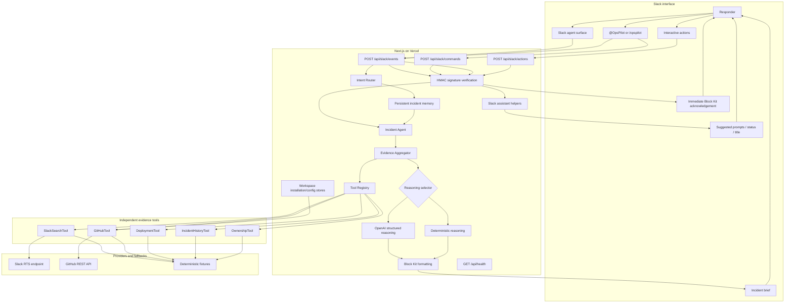
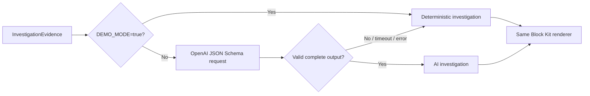

# OpsPilot Architecture

OpsPilot separates Slack transport, evidence collection, reasoning, and presentation so each layer can evolve without changing the user-facing workflow.

## System diagram



## Slack command flow

1. Slack sends a form-encoded command to `POST /api/slack/commands`.
2. Middleware validates `x-slack-signature`, rejects stale timestamps, and compares the HMAC signature safely.
3. The route parses `investigate <issue>` and returns an immediate in-channel acknowledgement.
4. Next.js `after()` continues the investigation after the HTTP response.
5. The final Block Kit brief is posted through `chat.postMessage`.

Slash-command payloads do not provide the acknowledgement message timestamp. Because a reliable `thread_ts` is unavailable, the final result is posted to the originating channel. Threading would require changing the delivery model to create and retain the initial Web API message timestamp.

## Conversational mention flow

1. Slack sends a signed `app_mention` event to `POST /api/slack/events`.
2. The route validates the raw request signature, handles URL verification, suppresses duplicate event IDs, and returns `200` immediately.
3. Processing continues through Next.js `after()`, and responses use `event.thread_ts` or the mention's `ts` as the thread root.
4. A deterministic intent router recognizes investigate, summarize, explain, status, timeline, owner, deployments, evidence, postmortem, resolve, and help requests.
5. Investigations call the existing incident agent and store an `IncidentContext` keyed by workspace, channel, and thread when available. Follow-up intents prefer thread context, then channel context.

When `DATABASE_URL` is configured, incident memory is stored in PostgreSQL with a 12-hour expiration window. If the database is missing or unavailable, the app falls back to the bounded in-memory store instead of failing Slack responses.

## Slack Agents & AI Apps flow

OpsPilot also supports Slack's official Agents & AI Apps experience through the same signed Events API route:

1. `assistant_thread_started` sets concise suggested prompts for common OpsPilot workflows.
2. Assistant-thread user messages reuse the existing conversational intent router and response handlers.
3. Long-running workflows call `assistant.threads.setStatus` with short progress text such as "Reviewing deployments and code changes..." or "Preparing risk assessment...".
4. The first meaningful request sets a contextual thread title with `assistant.threads.setTitle`, for example "Checkout incident investigation" or "OpsPilot repository audit".
5. `assistant_thread_context_changed` is acknowledged and logged without message contents; it exists for future channel/thread context enrichment.

Assistant helper calls are best-effort. If a workspace does not support one of the assistant APIs or a token is missing a required capability, the request still completes through the normal Slack message path. Mentions, slash commands, and Block Kit actions remain supported.

Slack also delivers user text typed in the agent direct-message conversation as the `message.im` bot event. OpsPilot treats those direct messages as conversational agent input, ignores bot/subtype message events such as edits/deletes/replies, and uses the message `ts` as the conversation thread identifier when Slack does not provide `thread_ts`.

## Workspace onboarding and repository configuration

The public product flow starts at Add to Slack:

```text
Homepage -> /api/slack/install -> Slack OAuth -> /setup -> GitHub OAuth -> /setup/github -> /setup/success
```

Slack installations are stored in `slack_installations`, GitHub OAuth tokens in `github_installations`, and repository/service configuration in `project_configs`. Tokens stay server-side and are never returned to frontend pages or Slack messages.

## Tool orchestration flow

`EvidenceAggregator` asks the registry for every `IncidentTool` and executes them concurrently. Every tool receives the same `InvestigationQuery` and returns one strongly typed result. Tools do not call each other, know about Block Kit, or perform incident reasoning.

Each execution records duration and success or failure. A failed tool becomes a `ToolExecutionFailure`; successful results are still assembled into `InvestigationEvidence`. This lets reasoning continue with partial evidence.

## AI fallback flow



The model is instructed to use only supplied evidence. Its response must match the complete `IncidentInvestigation` schema and then pass independent runtime validation. AI failure never reaches the Slack route as an exception.

## GitHub and Slack RTS-ready integrations

`GitHubTool` uses live GitHub data only when demo mode is off and credentials exist. It prefers the workspace GitHub OAuth token and workspace-selected repository, then falls back to deployment-wide `GITHUB_TOKEN` plus `GITHUB_OWNER` / `GITHUB_REPO`, then deterministic mock signals. It retrieves ten recent commits, enriches the newest three with changed files, calculates issue/service relevance, and falls back to mock signals on any failure.

`SlackSearchTool` uses live search only when demo mode is off, RTS is explicitly enabled, and endpoint credentials exist. `slackRealTimeSearch.ts` maps Slack's official `results.messages` response and conservative proxy variants from `unknown` using type guards. Empty, malformed, failed, or timed-out requests fall back to mock history.

The agent and aggregator see the same evidence contracts regardless of source.

## Repository audit flow

Repository audit is intentionally separate from incident investigation. `/opspilot audit repo` and natural-language requests such as `@OpsPilot check my repo for issues` call `RepoAuditTool`, which reviews recent commits, changed files, risky file patterns, package/config changes, migration files, auth/security paths, and API route changes. Follow-ups such as `@OpsPilot what should I test?` reuse the latest repo-audit context without rerunning GitHub unless the user requests a fresh audit.

## Demo mode behavior

With `DEMO_MODE=true`:

| Layer | Behavior |
| --- | --- |
| Slack commands and actions | Real, signed Slack traffic remains enabled |
| Slack search evidence | Deterministic mock history |
| GitHub evidence | Deterministic mock commits |
| Deployment evidence | Deterministic mock deployments |
| Incident history and ownership | Deterministic fixtures |
| Reasoning | Deterministic checkout or generic investigation |
| Block Kit and action handlers | Same production code paths |

The checkout report is intentionally the strongest fixture: it links customer reports, pool timeout logs, a five-minute deployment correlation, a risky code change, a prior matching incident, and named service owners.

## Interactive action flow

Button values contain a compact, validated incident context under Slack's value limit. The signed interactivity route acknowledges immediately and dispatches work through `after()`:

- **Open Incident Room:** creates or reuses a public channel, invites responders, and posts kickoff and checklist blocks.
- **Draft Postmortem:** reconstructs deterministic incident data and posts a structured draft.
- **Resolve Incident:** posts the final status and follow-up reminder.

Persistent incident state is implemented with PostgreSQL fallback to memory. Action idempotency is still a planned hardening item. MCP is intentionally not implemented yet; future MCP tools can sit behind the existing `IncidentTool` boundary.
